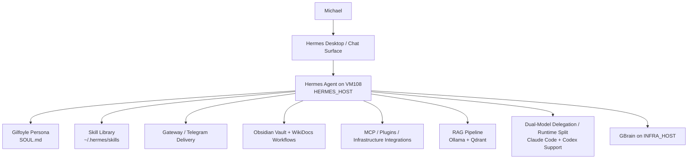

# MRDTech Hermes Stack

Public-safe documentation for the MRDTech Hermes / Gilfoyle control stack.

This repository documents the current Hermes control-node install, surrounding knowledge systems, and related integration layers using a proof-first standard: live config, service state, code on disk, and retained session history where needed. Historical details that are not fully re-proven are called out inside the numbered docs rather than blurred into fake certainty.

## Scope

This stack currently spans:

- **Hermes Agent** running on VM108 (`[HERMES_HOST]`) as the primary agent runtime
- **Gilfoyle persona** layered through `~/.hermes/SOUL.md`
- **Hermes gateway** for messaging / Telegram delivery
- **Obsidian vault integration** and WikiDocs documentation workflows
- **MCP / plugin integrations** for infrastructure access
- **RAG pipeline** using Ollama embeddings and Qdrant-backed retrieval patterns
- **Dual-model delegation/runtime split** involving Claude Code and Codex-related Hermes runtime support
- **GBrain** as a separate local knowledge / embedding workflow on the infrastructure host
- **Local skill catalog** under `~/.hermes/skills/` plus plugin-provided skill sets

## Grounded environment facts

Known from local session history and on-host state:

- Hermes host: **Ubuntu VM108** at `[HERMES_HOST]`
- Active Hermes profile: `default`
- Skill library lives at `~/.hermes/skills/`
- Plugins currently present include **Superpowers** and local audit logging
- OHM standalone skills were manually installed into the local skill library; no OMH plugin path is currently documented as installed
- `defuddle` CLI is installed separately and the local `defuddle` skill is only the wrapper/invocation guidance

## Architecture overview

## Project Index

### Core stack docs

1. [01 — Hermes setup](docs/01-hermes-setup.md)
   Current host identity, install shape, gateway unit, config structure, persona layer, plugin state, and the parts of setup history that are fully grounded versus reconstructed.

2. [02 — Obsidian vault](docs/02-obsidian-vault.md)
   Private vault layout, live git state on the Hermes and infrastructure hosts, WikiDocs separation, mirror direction, and the current source-of-truth boundary.

3. [03 — MCP gateway](docs/03-mcp-gateway.md)
   Read-only multi-backend Docker MCP gateway, six-server inventory, SSH tunnel access path, hardening controls, and auth-drift lessons.

4. [04 — RAG pipeline](docs/04-rag-pipeline.md)
   Qdrant/Ollama architecture, redaction pipeline, deterministic ingest behavior, Qdrant collection state, and the standing `vault_search.py` retrieval rule enforced from `SOUL.md`.

5. [05 — Telegram](docs/05-telegram.md)
   Telegram gateway rollout, current platform config, environment-key presence, and the current live evidence for messaging/alert delivery surfaces.

6. [06 — Dual-model delegation](docs/06-dual-model-delegation.md)
   Current Claude Code install/auth state, Codex runtime support in Hermes core, historical `openai-codex` model-provider evidence, and current delegation approval/spawn controls.

7. [07 — GBrain](docs/07-gbrain.md)
   PGLite-based GBrain install, version pinning, provider patch history, timeout investigation, exclusion workaround, and the current `239 pages / 705 chunks / 705 embedded` state.

### Skills inventory

8. [Skills catalog](docs/skills/README.md)
   Living inventory of installed local and plugin-provided skills with source/install-date evidence grading and explicit gap tracking.

## What is already covered in the numbered docs

The numbered docs are not placeholders. They already cover the major items that were previously under-scoped in this README:

- **MCP gateway inventory and hardening** — see [03 — MCP gateway](docs/03-mcp-gateway.md), which documents the six read-only backends, loopback-only bind, SSH tunnel path, secret-file posture, and auth-drift lessons.
- **Obsidian ↔ WikiDocs boundary** — see [02 — Obsidian vault](docs/02-obsidian-vault.md), which separates the private vault from the public/business-facing WikiDocs dataset and documents the mirror direction and role split.
- **RAG redaction + ingest flow** — see [04 — RAG pipeline](docs/04-rag-pipeline.md), which documents `redact.py`, `ingest.py`, `vault_search.py`, RFC1918 tokenization, `gitleaks detect --no-git`, deterministic UUID5 chunk IDs, and the current Qdrant collection state.
- **Dual-model delegation/runtime evidence** — see [06 — Dual-model delegation](docs/06-dual-model-delegation.md), which documents live Claude Code auth, absence of a current standalone `codex` binary, Hermes core Codex runtime support, and the July 21 `openai-codex` snapshot evidence.
- **GBrain install saga and closeout state** — see [07 — GBrain](docs/07-gbrain.md), which documents the PGLite engine, pinned version `0.44.1.0`, provider-path patch, unresolved timeout class, exclusion workaround, and the current `239 / 705 / 705` state.

## Skills Catalog

The skills catalog is a first-class part of this repo, not a hidden appendix.

- Entry point: [docs/skills/README.md](docs/skills/README.md)
- Current total rows: **450**
- Rows with session-backed install dates: **325**
- Rows still carrying any evidence gap: **125**

### Evidence legend

The catalog uses explicit evidence grades instead of pretending every skill has identical provenance:

- **confirmed-session** — backed by retained Hermes session history
- **confirmed-session+frontmatter** — backed by retained session history plus repo-style metadata preserved in the installed skill
- **inferred-family** — likely upstream family identified, but install-write record was not preserved
- **inferred-name-match** — upstream source strongly suggested by name/path, but not fully proven from retained install history
- **path-only** — skill is on disk locally, but retained history does not prove upstream source
- **filesystem-derived** install date — based on `SKILL.md` mtime, not a preserved install event

If you want the inventory itself instead of the summary, go straight to [docs/skills/README.md](docs/skills/README.md).

## Residual caveats that are genuinely still open

These are the real remaining uncertainties after the numbered docs were filled out. They are narrow historical caveats, not missing architecture sections:

- the exact first command sequence that created the original Hermes git install on this host
- the exact historical moment when child delegation first routed through one external runtime versus another
- the exact current process-level remote Ollama base URL wiring inside the running GBrain environment

Those caveats are already called out explicitly inside the relevant numbered docs. They do **not** invalidate the current architecture, inventory, or workflow sections above.
